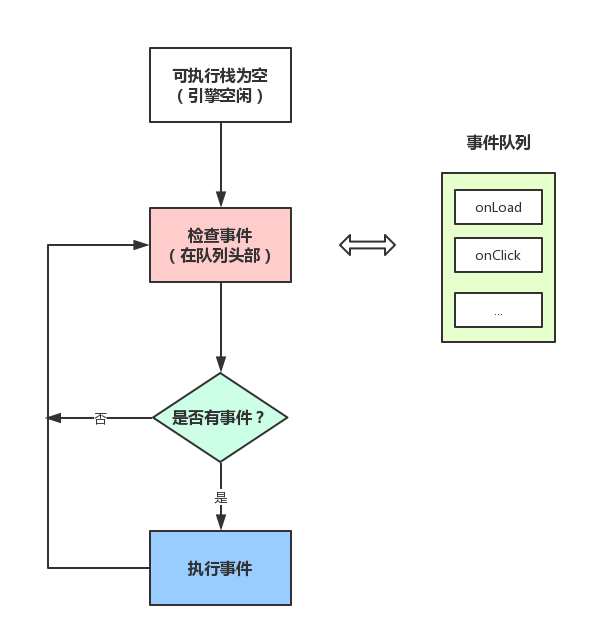
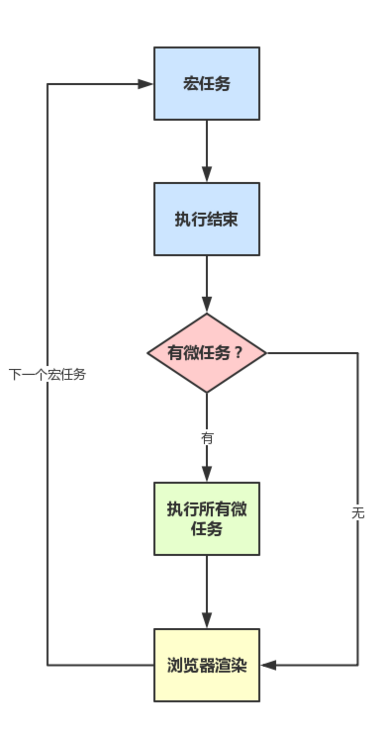

# 一些回答

## 从输入 URL 到页面加载完成的过程中都发生了什么事情？

### 从浏览器到浏览器内核

1. 接收到输入事件，浏览器可能会做一些预处理（如输入 [bai]，推断要访问[www.baidu.com]，在输入回车前马上开始建立TCP链接甚至渲染了）

2. 回车，检查URL，判断协议，如果是http就按照web标准处理，安全检查，调用loadURL方法

3. 查看缓存，设置UA等http信息，调用网络请求

### HTTP 请求的发送

通过 DNS 查询 IP、通过 Socket 发送数据

## JavaScript运行机制

### 浏览器都包含哪些进程

- Browser进程：浏览器的主进程（负责协调、主控），只有一个
- 第三方插件进程：每种类型的插件对应一个进程，仅当使用该插件时才创建
- GPU进程：最多一个，用于3D绘制等
- 浏览器渲染进程（浏览器内核）（Renderer进程，内部是多线程的）

### 浏览器内核（渲染进程）

可以这样理解，页面的渲染，JS的执行，事件的循环，都在这个进程内进行。（前端）

浏览器的渲染进程是多线程的

#### 包含了哪些线程

- GUI渲染线程
- JS引擎线程
- 事件触发线程
- 定时触发器线程
- 异步http请求线程

GUI渲染线程与JS引擎线程是互斥的

#### Worker

- 创建Worker时，JS引擎向浏览器申请开一个子线程（子线程是浏览器开的，完全受主线程控制，而且不能操作DOM）
- JS引擎线程与worker线程间通过特定的方式通信（postMessage API，需要通过序列化对象来与线程交互特定的数据）

JS引擎是单线程的

### 浏览器渲染流程

1. 解析html建立dom树
2. 解析css构建render树（将CSS代码解析成树形的数据结构，然后结合DOM合并成render树）
3. 布局render树（Layout/reflow），负责各元素尺寸、位置的计算
4. 绘制render树（paint），绘制页面像素信息
5. 浏览器会将各层的信息发送给GPU，GPU会将各层合成（composite），显示在屏幕上。

渲染完毕后就是load事件了，之后就是自己的JS逻辑处理了

### load事件与DOMContentLoaded

- 当 DOMContentLoaded 事件触发时，仅当DOM加载完成，不包括样式表，图片。(譬如如果有async加载的脚本就不一定完成)
- 当 onload 事件触发时，页面上所有的DOM，样式表，脚本，图片都已经加载完成了。（渲染完毕了）

所以，顺序是：DOMContentLoaded -> load

### CSS加载

css是由单独的下载线程异步下载的。

- css加载不会阻塞DOM树解析（异步加载时DOM照常构建）
- 但会阻塞render树渲染（渲染时需等css加载完毕，因为render树需要css信息）

### Event Loop

- JS分为同步任务和异步任务
- 同步任务都在主线程上执行，形成一个执行栈
- 主线程之外，事件触发线程管理着一个任务队列，只要异步任务有了运行结果，就在任务队列之中放置一个事件
- 一旦执行栈中的所有同步任务执行完毕（此时JS引擎空闲），系统就会读取任务队列，将可运行的异步任务添加到可执行栈中，开始执行

> 延伸：setTimeout不能准时执行原因 => 因为主线程可能不为空闲

### 定时器

由专门的定时器线程控制

当使用setTimeout或setInterval时，它需要定时器线程计时，计时完成后就会将特定的事件推入事件队列中。

#### setTimeout模拟定时

最佳实践是：用setTimeout模拟setInterval，或者特殊场合直接用requestAnimationFrame

> setInterval是每次都精确的隔一段时间推入一个事件，但是，事件的实际执行时间不一定就准确，还有可能是这个事件还没执行完毕，下一个事件就来了
>
> 累计效应（上面提到的），如果setInterval代码在（setInterval）再次添加到队列之前还没有完成执行，就会导致定时器代码连续运行好几次，而之间没有间隔。

### 宏任务/微任务

#### macrotask（又称之为宏任务）

每次执行栈执行的代码就是一个宏任务（包括每次从事件队列中获取一个事件回调并放到执行栈中执行）

- 每一个task会从头到尾将这个任务执行完毕，不会执行其它
- 浏览器为了能够使得JS内部task与DOM任务能够有序的执行，会在一个task执行结束后，在下一个 task 执行开始前，对页面进行重新渲染

> （`task->渲染->task->...`）

#### microtask（又称为微任务）

在当前 task 执行结束后立即执行的任务（在渲染之前）

> （`宏任务 -> 微任务 -> 渲染 -> 下一个任务...`）

----

运行机制总结：

- 执行一个宏任务（栈中没有就从事件队列中获取）
- 执行过程中如果遇到微任务，就将它添加到微任务的任务队列中
- 宏任务执行完毕后，立即执行当前微任务队列中的所有微任务（依次执行）
- 当前宏任务执行完毕，开始检查渲染，然后GUI线程接管渲染
- 渲染完毕后，JS线程继续接管，开始下一个宏任务（从事件队列中获取）

## 资料

- [最全JS运行机制](https://segmentfault.com/a/1190000012925872)
- [宏/微任务事件循环](https://jakearchibald.com/2015/tasks-microtasks-queues-and-schedules/)
