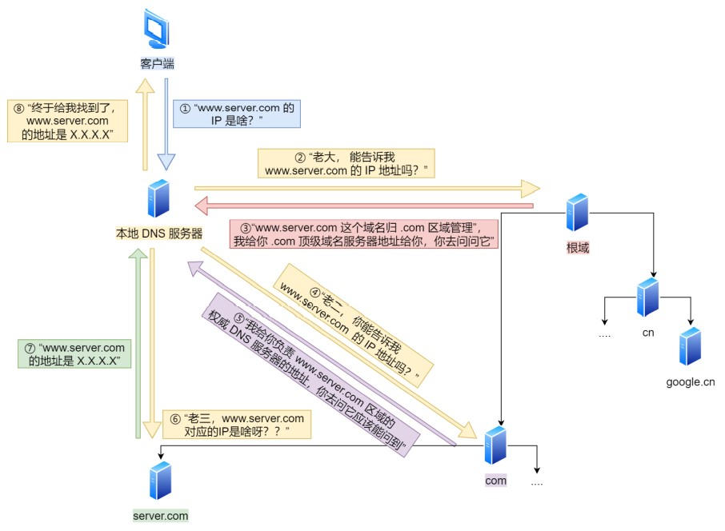

# IP基础知识

IP 在 TCP/IP 参考模型中处于第三层，也就是网络层。

网络层的主要作用是：实现主机与主机之间的通信，也叫点对点（end to end）通信。

TIPS：IP的作用是在复杂的网络环境中将数据包发送给最终目的主机。

## 几个概念

- **DNS**：可以将域名网址自动转换为具体的 IP 地址。
- **ARP**：ARP 协议可以借助 ARP 请求与 ARP 响应两种类型的包确定 MAC 地址
  - RARP：与 ARP 是相反的行为，已知 MAC 地址求 IP 地址
- **DHCP**：为设备动态分配IP
- **NAT**：把私有 IP 地址转换成公有 IP 地址，如两个私有 IP 地址都转换 IP 地址为公有地址 120.229.175.121，但是以不同的端口号作为区分。
- **ICMP**： 主要的功能包括 确认 IP 包是否成功送达目标地址、报告发送过程中 IP 包被废弃的原因和改善网络设置等。
  - 全称是 Internet Control Message Protocol，也就是互联网控制报文协议。
  - 网络包在复杂的网络传输环境里，常常会遇到各种问题。当遇到问题的时候需要传出消息，报告遇到了什么问题，这样才可以调整传输策略，以此来控制整个局面。

> ping 是基于 ICMP 协议工作的

## 网络层与数据链路层

 IP（网络层） 和 MAC （数据链路层）

明确两点：

- IP的作用：是主机之间通信用的
- MAC 的作用：是实现「直连」的两个设备之间通信，而 IP 则负责在「没有直连」的两个网络之间进行通信传输。

计算机网络中需要「数据链路层」和「网络层」这个分层才能实现向最终目标地址的通信。

源IP地址和目标IP地址在传输过程中是不会变化的，只有源 MAC 地址和目标 MAC 一直在变化。

## 域名解析的工作流程

即 DNS解析

### 概要

我们在上网的时候，通常使用的方式是域名，而不是 IP 地址，因为域名方便人类记忆。

那么实现这一技术的就是 **DNS 域名解析**，DNS 可以将域名网址自动转换为具体的 IP 地址。

域名的层级关系：

DNS 中的域名都是用句点来分隔的，比如 www.server.com ，这里的句点代表了不同层次之间的界限。在域名中，**越靠右的位置表示其层级越高**。

根域是在最顶层，它的下一层就是 com 顶级域，再下面是 server.com。

所以域名的层级关系类似一个树状结构：

- 根 DNS 服务器
- 顶级域 DNS 服务器（com）
- 权威 DNS 服务器（server.com）

**根域的 DNS 服务器信息保存在互联网中所有的 DNS 服务器中**。这样一来，任何 DNS 服务器就都可以找到并访问根域 DNS 服务器了。

因此，客户端只要能够找到任意一台 DNS 服务器，就可以通过它找到根域 DNS 服务器，然后再一路顺藤摸瓜找到位于下层的某台目标 DNS 服务器。

### 具体流程

浏览器首先看一下自己的缓存里有没有，如果没有就向操作系统的缓存要，还没有就检查本机域名解析文件 hosts ，如果还是没有，就会 DNS 服务器进行查询

查询的过程如下：

1. 客户端首先会发出一个 DNS 请求，问 `www.server.com` 的 IP 是啥，并发给本地 DNS 服务器（也就是客户端的 TCP/IP 设置中填写的 DNS 服务器地址）。

2. 本地域名服务器收到客户端的请求后，如果缓存里的表格能找到 `www.server.com`，则它直接返回IP 地址。如果没有，本地 DNS 会去问它的根域名服务器：“老大， 能告诉我 `www.server.com` 的IP 地址吗？” 根域名服务器是最高层次的，它不直接用于域名解析，但能指明一条道路。

3. 根 DNS 收到来自本地 DNS 的请求后，发现后置是 .com，说：“`www.server.com` 这个域名归.com 区域管理”，我给你 .com 顶级域名服务器地址给你，你去问问它吧。”

4. 本地 DNS 收到顶级域名服务器的地址后，发起请求问“老二， 你能告诉我 `www.server.com` 的 IP地址吗？”

5. 顶级域名服务器说：“我给你负责 `www.server.com` 区域的权威 DNS 服务器的地址，你去问它应该能问到”。

6. 本地 DNS 于是转向问权威 DNS 服务器：“老三，`www.server.com`对应的IP是啥呀？” server.com的权威 DNS 服务器，它是域名解析结果的原出处。为啥叫权威呢？就是我的域名我做主。

7. 权威 DNS 服务器查询后将对应的 IP 地址 X.X.X.X 告诉本地 DNS。

8. 本地 DNS 再将 IP 地址返回客户端，客户端和目标建立连接。

至此，完成了 DNS 的解析过程，示意图如下：

DNS 域名解析的过程蛮有意思的，整个过程就和我们日常生活中找人问路的过程类似，**只指路不带路**。
